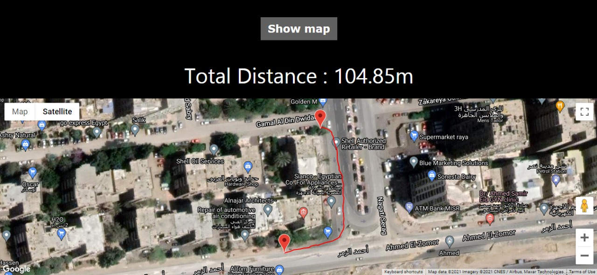

# GPSTrackingSystem
GPSTrackingSystem Embedded system project for Microcontroller course using Tiva-C
## NOTES
1- Everyone in the team contribute to the project in his branch.\
2- After adding our codes in one project the codes conflicted and causes errors so we ought to rewrite the code to be clean and well structured.\
3- In the video we send the LCD display 10499 instead of 104 because the LCD doesn't delete the previous reading I wish you accept this bug.
## The path we take

## the website displaying the path 
[a link](mo1998.github.io)
